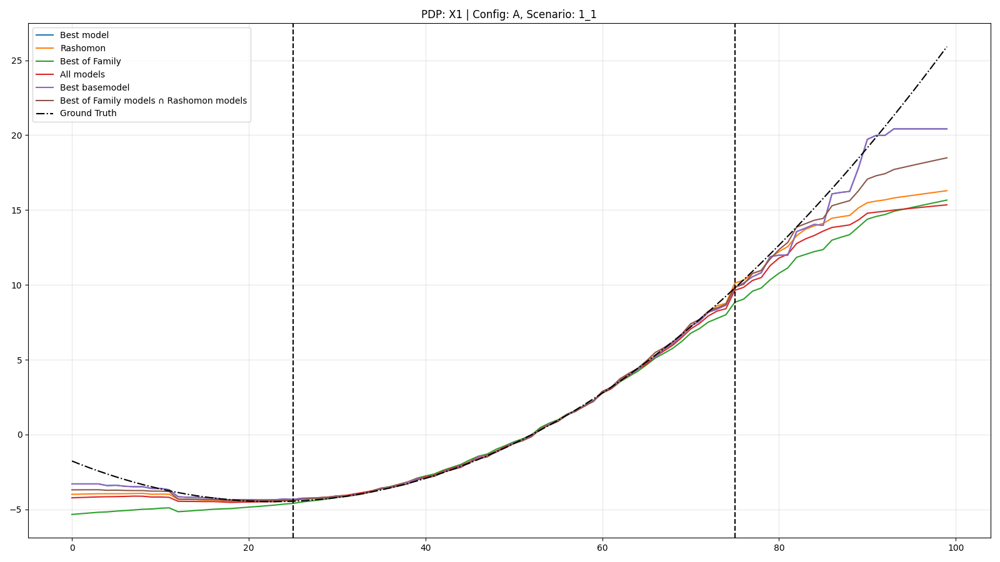
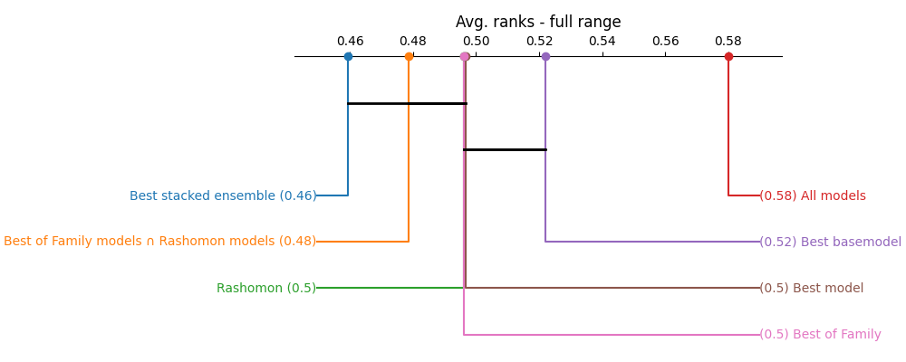
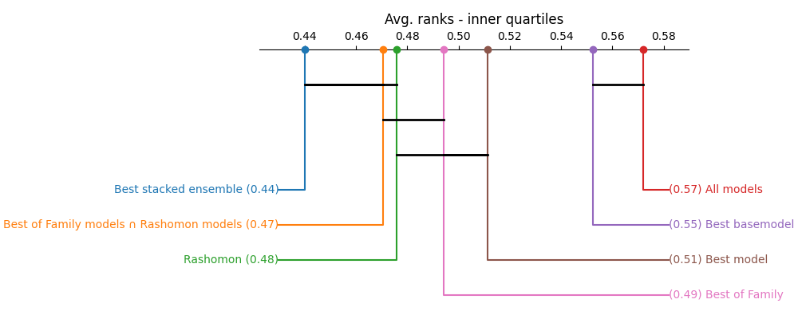
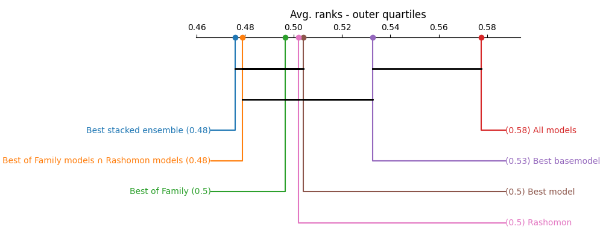

# Rashomon PDP

Quick and dirty exploration of ideas from [1].

> **NOTE:**  This is done just to satisfy my curiosity, expect mistakes. I tried to make it as reproducible as possible but due to setting `max_runtime_secs` and running on my old personal laptop from 2012 you might end up with different results

## Structure

- utils.py - contains `mean_distance_to_gt_pdp` and `get_rashomon_set`
- scenarios.py - contains ground truth functions used for data generation and gt pdp calculation
- results/X_Y_Z.ipynb - rendered notebooks; X = automl configuration [A...P], Y = scenario, Z = variance {1, 4, 9}
- results/pdps/X/Y_Z/{COL}_{PDP_TYPE}.csv - raw PDP values; X = automl configuration [A...P], Y = scenario, Z = variance {1, 4, 9}

## Experiment setting

I had some ideas about what could be better than the Rashomon PDP presented in [1]. None proved significantly better.

Rashomom PDP uses models solely based on their performance. My idea was that diversity in model types might be too useful to discard e.g. tree-based models don't extrapolate well and they can influence the combined PDP too much. This can be seen in the 3rd quartile of the following plot. The PDP of the best model is closer to the ground truth than the combination of multiple PDPs. In this plot best model is also the best base model (no Stacked Ensemble trained within the time limit).

Here we can also see that using "Best of Family" models also doesn't perform well. So I tried using intersection of models in the Rashomon set ($\vareps = 0.05$) and the "Best of Family".

So I have tested following scenarios:

- Best Model
- Best Basemodel (excludes Stacked Ensemble)
- Best of Family - uses best model from each family
- Rashomon - uses models from Rashomon set
- Rashomon intersected with Best of Family - uses only one model from each type within the Rashomon set
- All Models - uses all models
- Best Stacked Ensemble - SE already combines models so it seems logical to me to have it as as separately

> Knowing the inner workings of H2O-3 AutoML, I ran the AutoML with `nfolds=5` which forces Stacked Ensemble to use CV scores to train the metalearner. The default (`nfolds=-1`) might end up training Stacked Ensemble in blending mode.

Since there are those potential extrapolation issues I decided to look at the full range, inner 2 quartiles, and outer 2 quartiles to see if there is any significant difference in how the performance of the methods differs.

## Results

Due to time constraints (`max_runtime_secs`) Stacked Ensembles are not always present so they might look much better than they really are. Stacked Ensembles failed to train in my case due to time constraints in roughly 2/3 cases.

Nevertheless it seems possible to me that Stacked Ensembles could be this good as they try to combine models so that they generalize better in more sophisticated way than just picking models above some threshold or looking at their type. More evaluation results are in [03_evaluation.ipynb](03_evaluation.ipynb). 

## References
[1] M. Cavus, J. N. van Rijn, a P. Biecek, „Quantifying Model Uncertainty with AutoML and Rashomon Partial Dependence Profiles: Enabling Trustworthy and Human-centered XAI“, Inf Syst Front, Feb. 2026, doi: 10.1007/s10796-026-10698-3. https://doi.org/10.1007/s10796-026-10698-3
